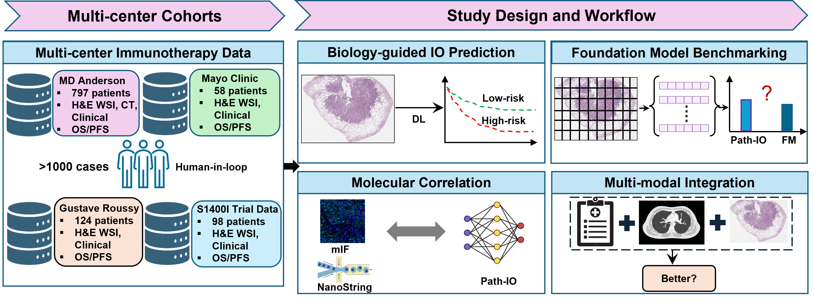

# Path-IO

> **About this Repository**  
> This repository hosts the complete *Path-IO* computational pathology framework for predicting immunotherapy outcomes in metastatic non–small cell lung cancer (mNSCLC) using H&E whole-slide images (WSIs).  
> The pipeline integrates patch-level tissue classification, WSI habitat mapping, ROI preprocessing, survival modeling, and patient-level risk stratification.  
> It is designed for reproducible, multi-institutional research in digital pathology and translational oncology.

---

## 🌟 Key Features

- **Multi-stage modular design:** From patch extraction to patient-level stratification, each step is modular and reproducible.  
- **Tissue habitat mapping:** Generates interpretable WSI-level tissue habitat maps.  
- **Patient-level survival modeling:** Aggregates biologically relevant regions of interest (ROIs) to build robust patient-level survival models.  
- **Clinical stratification:** Provides Kaplan–Meier curves, hazard ratios, and subgroup analyses for OS and PFS.  
- **Scalable & reproducible:** Designed for multi-institutional datasets with standardized outputs for downstream statistical analysis and publication.  

---

# 🧬 Path-IO Pipeline

Path-IO (*Pathology-Driven Immunotherapy Optimization*) is a biologically grounded and interpretable computational pathology framework that predicts patient response to immunotherapy directly from routine H&E whole-slide images.

The workflow includes:
- Patch extraction  
- Tissue habitat mapping  
- ROI preprocessing  
- Survival modeling  
- Patient-level risk scoring  
- Clinical stratification  

<p align="center">
  
</p>

<p align="center">
  <b>Overview of the Path-IO computational workflow.</b>
</p>

---

## 📦 Repository Structure

```text
Path-IO/
│
├── README.md
├── requirements.txt
│
├── figures/
│   └── path_io_pipeline.png
│
├── 1.Patch_extraction_WSI_habitat_map_generation/
│   ├── patch_extraction/
│   ├── tissue_classification/
│   ├── inference/
│   └── habitat_map_generation/
│
├── 2.WSI_map_preprocessing/
│
├── 3.Survival_prediction/
│
├── 4.Stratification/
│
└── outputs/

## ⚙️ Environment Setup

Before running any step, create and activate an environment and install the required dependencies.

```bash
# (optional) create a new conda environment
conda create -n pathio_env python=3.10 -y
conda activate pathio_env

# install all dependencies
pip install -r requirements.txt
```

---

## 🧩 Step 1: Patch Extraction + WSI Habitat Map Generation

**Folder:** `1.Patch_extraction_WSI_habitat_map_generation/`

This stage prepares slide-level spatial context.

### 1.1 Patch Extraction
- Divide each WSI into fixed-size tiles/patches at the desired magnification.  
- Store patch coordinates for spatial reconstruction.

### 1.2 Tissue Classification Training
- Train a deep learning model to classify tissue patches (e.g., tumor, stroma, necrosis, immune, etc.).  
- The model learns to identify biologically meaningful tissue types.

### 1.3 Patch-Level Inference
- Predict tissue type for all patches using the trained model.  
- Output includes patch label and (x, y) spatial coordinates.

### 1.4 WSI Habitat Map Generation
- Stitch labeled patches to reconstruct the full WSI tissue map.  
- Each region encodes the predicted tissue type.

### 🧾 Outputs from Step 1
- Patch-level labels
- Tissue habitat map per WSI  

---

## 🧠 Step 2: WSI Habitat Map Preprocessing

**Folder:** `2.WSI_map_preprocessing/`

This stage refines the raw tissue habitat maps into biologically meaningful **Regions of Interest (ROIs)** suitable for downstream survival modeling.

### 2.1 ROI Extraction 
- Identify informative tissue regions.  
- Remove background, artifacts, or non-tissue areas.  


### 🧾 Outputs from Step 2  
- Preprocessed WSI maps ready for survival training  

---

## 🔬 Step 3: Survival Prediction

**Folder:** `3.Survival_prediction/`

This stage builds the **patient-level survival models** to predict progression-free survival (PFS) and overall survival (OS).

### 3.1 Patient-Level Risk Score Prediction
Aggregate multiple WSIs per patient to form a unified patient representation. 

#### 🧮 Fisher Vector Encoding
- Encode all slide-level features for each patient into a single high-dimensional vector.  
- Captures the distribution of morphological patterns.

#### 🌲 Random Survival Forest (RSF) Training
- Train an RSF model on the Fisher-encoded patient vectors.  
- Output continuous **risk scores** per patient:  

### 🧾 Outputs from Step 3
- Trained slide- and patient-level models  
- Predicted risk scores for OS and PFS  
- Evaluation metrics (C-index)  

---

## 📊 Step 4: Stratification

**Folder:** `4.Stratification/`

This stage interprets **patient-level risk scores** into clinically meaningful groups and visualizes survival outcomes.

### 4.1 Risk Group Assignment
- Stratify patients into **High** and **Low** risk groups using:  
  - Quantile cut-offs or optimal KM thresholds  

### 4.2 Survival Stratification
- Generate **Kaplan–Meier (KM)** survival curves for:  
  - **Overall Survival (OS)**  
  - **Progression-Free Survival (PFS)**  
- Compute and report: HR, 95 % CI, log-rank *p* value.  


### 🧾 Outputs from Step 4
- Kaplan–Meier plots (OS & PFS)  

---


## 🧪 Notes
- All paths and parameters (patch size, magnification, model architecture, etc.) are configurable in the corresponding folders.  
- Supports multiple WSIs per patient for Fisher encoding and RSF aggregation.  
- Stratification assumes available survival metadata (OS, PFS status).  

---


## 🐞 Reporting Issues

Path-IO is under continuous development.  
If you encounter any issues while running the pipeline, please first ensure that all required packages listed in `requirements.txt` are properly installed and that your environment matches the recommended setup.  

If the problem persists, kindly open a new issue in the repository describing:
- The exact step or module where the error occurred  
- The error message or traceback (if any)  
- A minimal code snippet or demo example to help reproduce the issue  

We will review your report and provide a fix or workaround as soon as possible.  
Thank you for helping us improve Path-IO!

